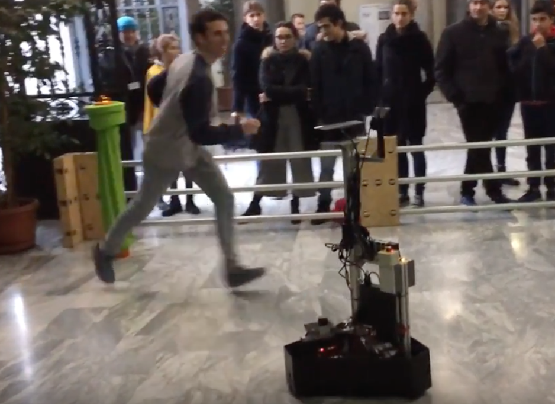

RoboTower 2.0 ROS stack
======================
  



This repository contains the ROS code used in the [RoboTower 2.0](https://www.youtube.com/watch?v=3azXf8V64iM), a Physically Interactive Robogame (PIRG) where a human player faces an omnidirectional mobile robot for the conquest of towers.

Installation
============

Git clone this repository in your ROS workspace. Here we call this later: ``catkin_ws``. On the Ubuntu terminal run:

```console
foo@ubuntu:~$ cd catkin_ws
foo@ubuntu:~/catkin_ws$ catkin_make --pkg driver_base
foo@ubuntu:~/catkin_ws$ catkin_make

```

Packages description
====================

**Control packages:** Contains packages for the control of the mobile robot. <br/>
* `basic_navigation` -- implements a very basic navigation capability going to towers in straight lines and stopping in case the player is in front of the robot. <br/>
* `game_navigation` -- implements navigation going to towers while avoiding players. This navigation implements a series of Fuzzy logic rules to decide how to avoid players.<br/>
* `behavior_control` -- decides which towers the robot should attack <br/>
* `steering_behavior_control` -- uses steering behavior to perform navigation<br/>

**Core packages:**<br/>
* `joystick` -- the joystick node for controlling the robot with a PS3-like joystick. <br/>
* `ira_laser_tools_newer` -- merges data from hokuyo laser msgs.<br/>
* `triskarone` -- contains essential low-level nodes for the robot: laser management (hokuyo node), odometry, kinematics, etc. <br/>
* `arduino_sketches` -- contains arduino programs used on game towers trasmitter and onboard receiver, player imu sensor (transmitter/receiver).  <br/>
* `yocs_velocity_smoother` -- velocity smoother. <br/>
* `rosserial` -- package for talking to wifi module in the towers. <br/>

**Game packages:**<br/>
* `robogame` -- metapackage. <br/>
* `game_manager` -- controls the game logic (led status)<br/>
* `tower_manager` -- a node to publish useful game tower data. <br/>

**Logging packages:**</br>
* `data_collection`: a package containing launch files describing which topics to save <br/>
* `record_bag` - a package to record bag files by pressing a joystick button.
* `video_recorder` -- for publishing image frames from a external USB camera.<br/>
* `visualization`: a graphical interface for showing the statuses of leds. <br/>

**Perception packages:**</br>
* `activity_monitor`: <br/>
* `activity_recognition`: a package to read that from accelerometer and classify the humanactivity into running, locally moving and walking. <br/>
* `player_feature`: a package for classifying the player activity wrt towers<br/>
* `player_tracking`: a package for player tracking using a particle filter and the laser data. <br/>

**Simulation packages:**</br>
* `robogame_stage`: a package to simulate robotower 2.0 on stage simulator. <br/>

**Deprecated packages:** a number of packages have been created by were deprecated during the course of the research. Such packages are located in the `_deprecated` folder.</br>
* `heartbeat` -- package to monitor nodes status. Acts like a 'ping' mechanism to track wether important nodes are still alive. <br/>
* `kinect_tracker` -- detects and publisher player position based on a Microsoft Kinect One device and color blob detection. <br/>

**Additional folders (NOT PACKAGES):**</br>
Inside _auxiliary folder:

* `_gnuplot` -- folder with some predefined config files for using gnuplot.</br>
* `_arduino` -- folder containing arduino sketches used on onboard arduino and the ones located on the game towers.</br>
* `_help` -- folder containing some infos regarding setup issues.</br>
* `_scripts` -- folder containing some useful scripts and programs.</br>

How to use
============
To launch the basic nodes:
```console
foo@ubuntu:~$ roslaunch triskar triskarone.launch
```

To run the game choose a given launch file in the `game_manager` launch folder.

Dependencies
============
The ecosystem depends on some ROS standard packages, such as `amcl` and `gmapping`. A full installation of ROS may be enough for compiling the code. Some deprecated packages are known to depend on libraries, such as: `OpenCV`, `LibFreenect2` and `IAI Kinect2` (all available on Github).

Credits
=======

RoboTower was invented by [Ewerton Lopes](https://github.com/ewerlopes) during his PhD thesis at Politecnico di Milano (Milan, Italy) under supervision of Professor [Andrea Bonarini](https://github.com/andybon). Several other collaborators and master students joined the project, among those: [Davide Orrù](), [Enrico Piazza](https://github.com/Enri2077), [Stefano Boriero](https://github.com/StefanoBoriero), [Gabriele Oliaro](https://github.com/gabrieleoliaro), [Laura Donadoni](), [Ruchik Mishra]() and [Lesly Zerna](https://github.com/l3s777).

Papers
======
```bib
@article{oliveira_learning_2018,
	title = {Learning and {Mining} {Player} {Motion} {Profiles} in {Physically} {Interactive} {Robogames}},
	volume = {10},
	issn = {1999-5903},
	url = {http://www.mdpi.com/1999-5903/10/3/22},
	doi = {10.3390/fi10030022},
	abstract = {Physically-Interactive RoboGames (PIRG) are an emerging application whose aim is to develop robotic agents able to interact and engage humans in a game situation. In this framework, learning a model of players’ activity is relevant both to understand their engagement, as well as to understand specific strategies they adopted, which in turn can foster game adaptation. Following such directions and given the lack of quantitative methods for player modeling in PIRG, we propose a methodology for representing players as a mixture of existing player’s types uncovered from data. This is done by dealing both with the intrinsic uncertainty associated with the setting and with the agent necessity to act in real time to support the game interaction. Our methodology first focuses on encoding time series data generated from player-robot interaction into images, in particular Gramian angular field images, to represent continuous data. To these, we apply latent Dirichlet allocation to summarize the player’s motion style as a probabilistic mixture of different styles discovered from data. This approach has been tested in a dataset collected from a real, physical robot game, where activity patterns are extracted by using a custom three-axis accelerometer sensor module. The obtained results suggest that the proposed system is able to provide a robust description for the player interaction.},
	number = {3},
	journal = {Future Internet},
	author = {Oliveira, Ewerton L. S. and Orrú, Davide and Morreale, Luca and Nascimento, Tiago P. and Bonarini, Andrea},
	year = {2018}
}

@inproceedings{oliveira_activity_2017,
	address = {Lisbon},
	title = {Activity {Recognition} in a {Physical} {Interactive} {RoboGame}},
	booktitle = {2017 {Joint} \{{IEEE}\} {International} {Conference} on {Development} and {Learning} and {Epigenetic} {Robotics}, {ICDL}-{EpiRob} 2017, {Lisbon}, {Portugal}, {September} 18-21, 2017},
	author = {Oliveira, Ewerton and Orrù, Davide and Nascimento, Tiago and Bonarini, Andrea},
	year = {2017},
	pages = {1--6}
}

@inproceedings{oliveira_modeling_2017,
	address = {New York, NY, USA},
	series = {{HAI} '17},
	title = {Modeling {Player} {Activity} in a {Physical} {Interactive} {Robot} {Game} {Scenario}},
	isbn = {978-1-4503-5113-3},
	url = {http://doi.acm.org/10.1145/3125739.3132608},
	doi = {10.1145/3125739.3132608},
	abstract = {We propose a quantitative human player model for Physically Interactive RoboGames that can account for the combination of the player activity (physical effort) and interaction level. The model is based on activity recognition and a description of the player interaction (proximity and body contraction index) with the robot co-player. Our approach has been tested on a dataset collected from a real, physical robot game, where activity patterns extracted by a custom 3-axis accelerometer sensor module and by the Microsoft Kinect sensor are used. The proposed model design aims at inspiring approaches that can consider the activity of a human player in lively games against robots and foster the design of robotic adaptive behavior capable of supporting her/his engagement in such type of games.},
	urldate = {2017-11-10},
	booktitle = {Proceedings of the 5th {International} {Conference} on {Human} {Agent} {Interaction}},
	publisher = {ACM},
	author = {Oliveira, Ewerton and Orrù, Davide and Nascimento, Tiago and Bonarini, Andrea},
	year = {2017},
	keywords = {human-robot interaction, player modeling, robogame, user modeling},
	pages = {411--414}
}
```

Acknowledgement
===============
This work was supported by the Brazilian National Council for Scientific and Technical Development (CNPq) under the Science Without Borders scholarship program Number 203677/2014-5.